  

  

  
  
  
  

---

## What I Work With

  

  
  
  
  
  
  
  
  
  

---

## About Me

- B.Tech Information Technology graduate from SRMCEM (AKTU), Lucknow.
- Hands-on experience in Generative AI, machine learning, deep learning, computer vision, and data analytics.
- Skilled in Python, RAG, LangChain, FAISS, Hugging Face models, TensorFlow, OpenCV, and Scikit-learn.
- Focused on building reliable, explainable, and practical AI/ML solutions.

---

## Current Focus

- Building production-ready AI/ML systems with Python
- Improving RAG pipelines and LLM application workflows
- Strengthening deep learning and computer vision model evaluation
- Creating practical AI tools with clean interfaces and measurable outcomes

---

## Experience

**Generative AI Trainee - LearnTrail**

Completed Generative AI training with hands-on experience in LangChain, RAG-based document Q&A, Hugging Face transformer models, vector indexing, semantic search, and prompt engineering.

**Data Analyst Trainee - IBM SkillsBuild**

Gained hands-on experience with Python, Pandas, NumPy, data cleaning, EDA, and machine learning models including Linear Regression, Logistic Regression, and Decision Tree for analytical problem solving.

---

## GitHub Activity

  

  
  

  

---

## Featured Work

**[DeepScan - Deepfake Video Detection](https://github.com/Manish7512/deepfake-video-detection)** - Deepfake detection pipeline using TensorFlow, OpenCV, MTCNN, Xception, EfficientNet, and Flask, achieving 77.35% accuracy and 0.808 AUC.

**Resume Analyzer and Job Fit Generator** - AI-powered resume-to-job matching system using FAISS, Hugging Face embeddings, Gemini API, and Gradio.

**Online Credit Card Fraud Detection Model** - Fraud detection analysis and classification using Python, Pandas, NumPy, and Scikit-learn, achieving 90% accuracy.

**GitHub**

---

## Connect

  
  
  

  

